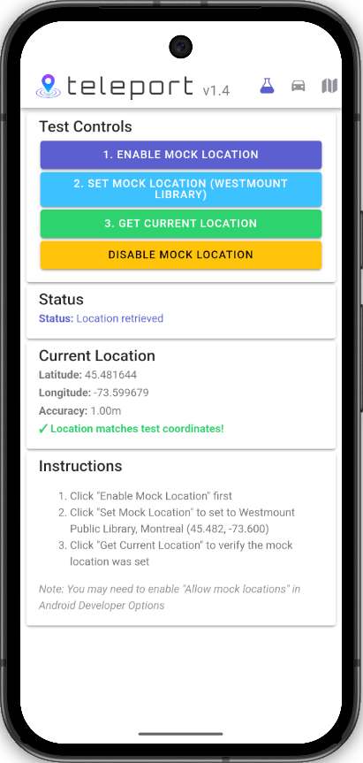
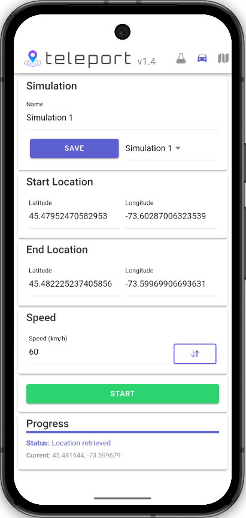
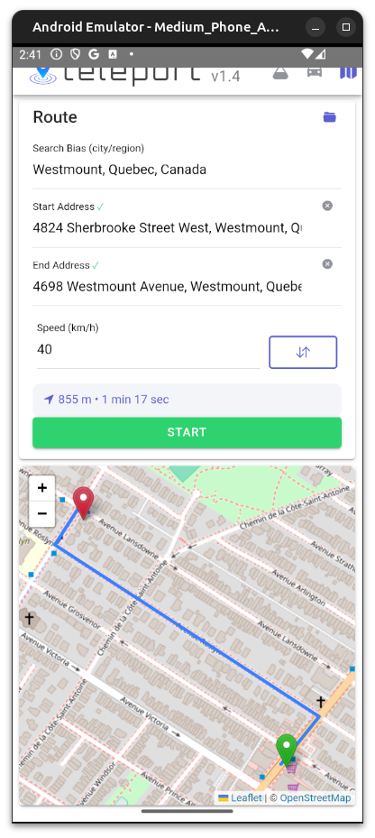

<div align="center">
  
  <h1>
    <picture>
      <source media="(prefers-color-scheme: dark)" srcset="https://readme-typing-svg.demolab.com?font=Orbitron&weight=400&size=48&duration=1&pause=999999&color=FFFFFF&center=true&vCenter=true&width=315&lines=t%E2%80%8A%E2%80%8Ae%E2%80%8A%E2%80%8Al%E2%80%8A%E2%80%8Ae%E2%80%8A%E2%80%8Ap%E2%80%8A%E2%80%8Ao%E2%80%8A%E2%80%8Ar%E2%80%8A%E2%80%8At">
      
    </picture>
  </h1>
  <p>A mobile app for Android that allows you to mock GPS locations and simulate realistic driver movement between coordinates.</p>
</div>

## Features

- **Mock Location Testing** - Set your device to a specific GPS location (e.g., Westmount Public Library, Montreal)
- **Driver Simulation** - Simulate realistic movement between two coordinates
  - Configure start and end coordinates
  - Set travel speed (km/h)
  - Save and load simulations for quick access
  - Flip start/end coordinates with one tap
  - Pause/resume simulation in progress
  - Real-time progress tracking with current coordinates
  - Auto-resets to idle state when destination reached
- **Route Navigation** - Map-based routing with real road navigation
  - Address search with autocomplete (powered by Mapbox)
  - Real road routing via OSRM
  - Visual route preview on map
  - Save and load routes
  - Swap start/end addresses
  - Configurable travel speed
- **Responsive UI** - Compact layout optimized for small phone screens
- **Dark Mode** - Automatically adapts to your device's light/dark mode preference

## Screenshots

<div align="center">
  
  
  
  <br/>
  <em>Test Screen, Simulation Screen, and Route Screen</em>
</div>

1. **Test Screen** - Quick location mocking with preset coordinates
2. **Simulation Screen** - Driver simulation with customizable start/end coordinates
3. **Route Screen** - Map-based routing with address search and real road navigation

## Requirements

- Android device with Developer Options enabled
- "Allow mock locations" enabled in Developer Options
- Node.js and npm installed (for development)

## Installation

### For Users (Manual)

1. Download the latest APK from the [releases page](https://github.com/vinctustech/teleport/releases)
2. Install on your Android device (you may need to enable "Install from Unknown Sources")
3. Enable Developer Options on your device (tap "Build Number" 7 times in Settings → About Phone)
4. Enable mock location app:
   - **Option A (On device):** Go to Settings → Developer Options → Select mock location app → Choose "teleport"
   - **Option B (Via ADB):** If the above option isn't available on your device, connect to a computer and run:
     ```bash
     adb shell appops set io.github.vinctustech.teleport android:mock_location allow
     ```

### For Users (ADB)

If you have ADB set up, you can install and configure everything with these commands:

```bash
# Install the APK
adb install teleport-v1.4-debug.apk

# Enable developer settings
adb shell settings put global development_settings_enabled 1

# Set teleport as the mock location app
adb shell appops set io.github.vinctustech.teleport android:mock_location allow

# Launch the app
adb shell am start -n io.github.vinctustech.teleport/.MainActivity
```

### For Developers

1. Clone the repository:
   ```bash
   git clone https://github.com/vinctustech/teleport.git
   cd teleport
   ```

2. Install dependencies:
   ```bash
   npm install
   ```

3. Build the app:
   ```bash
   npm run build
   ```

4. Sync with Android:
   ```bash
   npx cap sync android
   ```

5. Run on device/emulator:
   ```bash
   npx cap run android --target <device-name>
   ```

## Usage

### Test Screen

1. Tap the flask icon in the toolbar to access the test screen
2. Click "Enable Mock Location" to activate mock location provider
3. Click "Set Mock Location" to set your device to Westmount Public Library, Montreal
4. Click "Get Current Location" to verify the mock location
5. Click "Disable Mock Location" when done

### Driver Simulation Screen

1. Tap the car icon in the toolbar to access the simulation screen
2. Give your simulation a name (e.g., "Simulation 1")
3. Enter start coordinates (latitude and longitude)
4. Enter end coordinates (latitude and longitude)
5. Set desired speed in km/h
6. Click "Save" to save this simulation for later use
7. Click "Start" to begin simulation
8. Use "Pause"/"Resume" buttons to control the simulation
9. Click "Stop" to end the simulation and disable mock location
10. Use the flip button next to the speed input to swap start/end coordinates
11. Load saved simulations from the dropdown menu

The simulation uses the Haversine formula to calculate distance and interpolates your position along a straight line between the two points, updating your location every second based on the configured speed. When the destination is reached, the location is set 20 meters beyond the endpoint to ensure apps polling for coordinates capture the final location.

### Route Screen

1. Tap the map icon in the toolbar to access the route screen
2. Enter a city/region in the "Search Bias" field to improve address search results
3. Type a start address and select from autocomplete suggestions
4. Type an end address and select from autocomplete suggestions
5. Set desired speed in km/h
6. The route will be calculated automatically and shown on the map
7. Click "Start" to begin following the route
8. Use "Pause"/"Resume" buttons to control the simulation
9. Click "Stop" to end the simulation
10. Use the swap button to reverse start and end addresses
11. Save routes for quick access later

The route screen uses OSRM for real road routing, so your simulated location will follow actual streets and roads rather than a straight line.

## Development

### Available Scripts

- `npm run build` - Build the React app for production
- `npm run dev` - Start development server
- `npx cap sync android` - Sync web assets with Android project
- `npx cap run android` - Build and run on Android device/emulator
- `npx cap open android` - Open Android project in Android Studio

### Project Structure

```
teleport/
├── src/
│   ├── components/
│   │   └── DriverSimulation.tsx       # Simulation UI component
│   ├── pages/
│   │   ├── Home.tsx                   # Main app screen with both test and simulation
│   │   └── Home.css                   # App styles
│   ├── plugins/
│   │   └── LocationMocker.ts          # TypeScript interface for native plugin
│   └── theme/
│       └── variables.css              # Ionic theme with dark mode support
├── android/
│   └── app/src/main/java/io/github/vinctustech/teleport/
│       ├── MainActivity.java          # Android main activity
│       └── LocationMockerPlugin.java  # Native location mocking plugin
└── public/
    ├── fonts/
    │   └── Orbitron-Variable.ttf      # Custom font for app branding
    └── logo.png                       # App logo
```

## Technologies

- **Ionic Framework** - Cross-platform mobile UI components
- **React** - UI framework
- **TypeScript** - Type-safe JavaScript
- **Capacitor** - Native mobile runtime
  - Capacitor Preferences API - Persistent simulation storage
- **Leaflet** - Interactive map display
- **Mapbox Search** - Address autocomplete
- **OSRM** - Open Source Routing Machine for road navigation
- **Android LocationManager API** - GPS location mocking
- **Orbitron Font** - Custom typography for app branding

## How It Works

The app uses a custom Capacitor plugin (`LocationMockerPlugin`) that interfaces with Android's `LocationManager` test provider API to mock GPS locations. When enabled, it creates a test GPS provider that overrides the device's actual location. The driver simulation calculates the distance between two points using the Haversine formula and updates the mock location at regular intervals to simulate realistic movement.

The `LocationMockerPlugin` provides TypeScript bindings for the native Android LocationManager functionality, allowing the React UI to control mock locations through a simple JavaScript interface. This plugin handles enabling/disabling the test provider, setting mock locations with latitude/longitude/accuracy, and querying the device's current location.

Simulations are persisted using Capacitor Preferences API (Android SharedPreferences), allowing you to save, load, and quickly switch between different route configurations. When a simulation reaches its destination, the final location is set to a point 20 meters beyond the endpoint along the same bearing—this ensures that apps polling for location updates at intervals will reliably capture the destination coordinates.

## Permissions

The app requires the following Android permissions:
- `ACCESS_FINE_LOCATION` - To access GPS provider
- `ACCESS_COARSE_LOCATION` - For location services
- `android:mock_location` - To set mock locations (requires ADB command)

## License

MIT
